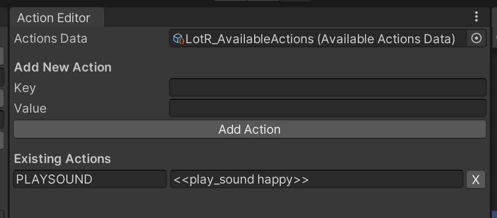

# Introduction
This Parser is a tool for taking in a .csv and outputting a .yarn file (usable by [YarnSpinner]([url](https://docs.yarnspinner.dev/))). It is most helpful for narrative games that will use a lot of complex [YarnCommands]([url](https://docs.yarnspinner.dev/write-yarn-scripts/scripting-fundamentals/commands )). 

The project has an example case for the game "Starweave". This parser was developed because every line of character needed a function call before it that would swap out which character portrait is shown based on the speaker and their emotion (plus other things, such as play audio, but that has been removed for simplicity's sake for this repo!). 

# How to Use
## Setup
There are a few steps that need to be taken before actually using the parser.
1. Set up .csv formatting and syntax. [.csv setup](#csv-setup)
2. Adding Speakers. [Adding Speakers as `SpeakerData`](#Adding-Speakers-as-`SpeakerData`)
3. Adding Syntax and YarnCommands. [Creating and Populating `AvailableActions`](#Creating-and-Populating-`AvailableActions`)

## Parsing a File
1. Open Tools > Parser (at the top bar). This will open the Parser. 


2. Select target .csv

   

3. Select the target output folder.

4. Set a `AvailableActions` in "Available Actions Data"--this field is necessary for the parser to read custom synax used in your spreadsheet to replace it with `YarnCommand` calls. See [Creating and Populating `AvailableActions`](#creating-and-populating-availableactions) for how to set up your syntax and `YarnCommand` calls.
**Note: it will default to `Default_AvailableActions` if there is no "Available Actions Data" set. 

7. Click Convert to Yarn! It should only take a second or two, and once it’s completed, a properly formatted .yarn file will appear in the Output Folder! The console will also print the file output path. 


# CSV Setup 
This Unity project has an example that is designed to parse a spreadsheet set up like this: 


The columns are the speaker's name, their emotion, and their actual dialogue line. The parser's default behavior is to treat every individual row as a "data" packages (basically everything that will be needed to execute an individual line of dialogue that are shown via YarnSpinner (what changes upon clicking "continue"). 
You can set up your own .csv however desired, but pay very close attention to syntax and setup. 
Be mindful that a .csv will use COMMAS to separate the columns, so be careful using commas within cells. It could lead to unintended behavior if you ever try and use commas to split the file. 
The .csv setup I used was all dialogue is wrapped in quotation marks. 

If you are using [YarnCommands](https://docs.yarnspinner.dev/yarn-spinner-for-unity/creating-commands-functions), make sure you use a special, consistent syntax for calling them. In my example, we used `SYSTEM` in column A, and used square brackets ([ ]) on both sides of the `YarnCommand`'s name to let the parser know to search for a `YarnCommand`.

# Adding Speakers as `SpeakerData`
All speakers in your dialogue must have a `SpeakerData` object. This is how the parser will know how to generate yarn-formatted text for your dialogue.

1. Open the `AvailableActions` editor under Tools > Action Editor. That will open the window below:


2. Add a speaker name, with the correct punctuation and capitalization. (Optional: add `Sprite` and `Audioclip`).
3. Click "Create Speaker Data". This will create a `SpeakerData` object to the "SpeakerData" folder. 

# Creating and Populating `AvailableActions`
If you are using [YarnCommands](https://docs.yarnspinner.dev/yarn-spinner-for-unity/creating-commands-functions), make sure you use a special, consistent syntax for calling them. In my example, we used `SYSTEM` in column A, and used square brackets ([ ]) on both sides of the `YarnCommand`'s name to let the parser know to search for a `YarnCommand`.
, make sure you use a special, consistent syntax for calling them. The `Action Editor` allows you to add the syntax on your spreadsheet and associated `YarnCommand` as Key-Value pairs (KVP) and store them to a ScriptableObject. You can also have multiple Dictionaries. This allows you to parse different sheets  and read from different dictionaries if desired! 

1. Open the `AvailableActions` editor under Tools > Action Editor. That will open the window below:



2. In the `Resources` folder, right click: Create > Utilities > Available Actions. This will create an `AvailableActions` object. It **must** be saved to the `Resources` folder. If it is not, when parsing a `.csv` an error will be thrown.
3. Drag and drop that `AvailableActions` object into the "Actions Data" field on the Action Editor.


4. Enter the .csv Syntax and associated YarnCommand function call.
      csv Syntax: the spreadsheet syntax 
      YarnCommand Call: the correctly formatted `YarnCommand` call to insert in the `.yarn` file.
   
5. Click "Add Action". It will populate below under "Existing Actions". 
**Note: direct, manual editing each entry into the Existing Actions dictionary is allowed.

# Implementation 
## Parser.cs 
`Parser.cs` handles the parsing logic for the .csv. It reads in the .csv as a string, and splits it first by linebreaks. 
Replace `TODO` in `ConvertToYarn()` with your own custom implmentation, depending on how your .csv is set up. 

## ParserUtilities
`DialogueLine` is a class for each row of dialogue in the original .csv/spreadsheet. `Translate()` handles taking in the input and formatting it as desired for the output .yarn file. In my case, I needed a function call before every line of character dialogue, so the function injects a `<< initialize_line >>` before every spoken dialogue line. 

Replace the body of `Translate()` to implement your own custom .yarn output based on your project's needs. 

`Utilities` is a class for adding YarnCommand functions. Replace/add your own custom Yarn Functions to `availableActions` dictionary to inject their calls into the .yarn file. 

# YarnSpinner setup
Create a YarnProject in the same folder that the Yarn files are outputting to. This will automatically add the .yarn file to the YarnProject you are using. 


# Example Setup
In the scene `ParserDemo`, there is a sample Project and `.yarn` file that was generated using the Parser Tool. It read from the `LotR_AvailableActions` Dictionary.

It reads from `LotR.csv` to show the character name, character sprite and text dialogue. 
The sprite is set via SetSpeakerInfo() in `YarnCommands.cs`. 

``` C#
[YarnCommand("initialize_line")]
public static void SetSpeakerInfo(string name, string expression)
{
   speaker.sprite = speakerDictionary[name];
}
```

## How to Duplicate this Setup
## Parsing and Setup
1. Open the Action Editor under Tools > Action Editor. 
2. Create a `Resources` folder. In that folder, right click and Create > Utilities > Available Actions. Name it `LotR_ActionsDictionary` or something similar. It will be storing the Dictionary that matches the `.csv` syntax with what to replace it with in the `.yarn` file.
3. Drag and drop `LotR_ActionsDictionary` into the Actions Data field.
4. Add `WAIT` in "csv Syntax" and <<customWait 2>> in "YarnCommand call". For this example, the only custom function needed is Wait.
   


5. Open the Speaker Editor under Tools > Speaker Editor.
   A. Create one for "frodo". Fill "frodo" as the name, and `frodo-sprite` for the Sprite field and click "Create SpeakerData"


   B. This will output `frodo` (type SpeakerData) to Assets > SpeakerData


   Repeat A and B for "gandalf" 

6. Generate the `.yarn` file. Open the Parser under Tools > Parser. Select `LotR.csv` as the CSV File. Select "TargetYarnFiles" as the Output Folder. Set `LotR_ActionsDictionary` as the "Available Actions Data".

 7. Click "Convert to Yarn". This will produce `LotR.yarn` to the same folder as the YarnProject. Because they are in the same folder, the YarnProject will automatically add it to the list of Yarn Scripts.

<!--  -->

### Scene Setup 
8. Drag and drop a `ParserDialogueSystem` prefab into the scene.
   


9. Add an empty GameObject and call it `YarnCommands`. Attach a `YarnCommands.cs` as a component to this object. In the `YarnCommands.cs` field for "Sprite", add the `LotR_SpeakerSprite` GameObject. This is how we will render the character image.
    


10. Press play, it should play a few lines of dialogue, and swap the sprites between Gandalf and Frodo!
